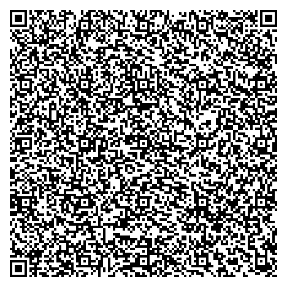

# QR3K

A challenge to create complete games that fit entirely within a QR code's data capacity.

## What is QR3K?

QR3K (QR 3 Kilobytes) is a constraint-based game development challenge inspired by classic demoscene competitions and js1k contests. The goal: create a complete, playable game that fits entirely within a single QR code.

## The Constraint

- **Maximum size**: 2,953 bytes (the capacity of a Version 40 QR code - 177x177 pixels)
- **Platform**: Web browsers
- **Delivery**: The entire game must be encoded in the QR code itself
- **Format**: Base64-encoded HTML containing the complete game

## How It Works

1. **Game Development**: Create a minimal HTML page with embedded CSS/JavaScript
2. **Encoding**: Base64 encode the entire game
3. **URL Parameter**: Pass the encoded game as a URL parameter
4. **QR Code**: Generate a QR code containing the full URL
5. **Playback**: Scan the QR code to instantly load and play the game

## Architecture

### URL Structure

QR3K uses a single unified encoding method:

```
# XOR-obfuscated content (HTML or JavaScript, iOS Safari compatible)
https://www.vincentbruijn.nl/qr3k/?x=<xor-encoded-content>
```

The system auto-detects whether the decoded content is HTML or JavaScript and handles it appropriately.

### Loader (index.php)

A minimal PHP page that:

- Starts a session to bypass Varnish cache
- Extracts the `x` parameter from the URL
- XOR decodes with "qr3k" key
- Auto-detects content type and handles appropriately:
  - HTML content → inject into DOM
  - JavaScript content → execute directly
- Handles errors gracefully

### XOR Obfuscation

For iOS Safari compatibility, QR3K uses XOR encryption with "qr3k" as the repeating key:

1. **Encoding**: JavaScript code is XOR'd with "qr3k" (q=113, r=114, 3=51, k=107)
2. **Base64**: Result is base64 encoded for URL safety
3. **Obfuscation**: JavaScript keywords become unrecognizable to iOS filtering
4. **Decoding**: Browser reverses the process and executes the original code

### Game Format

Games can be either pure JavaScript or HTML with a single script tag:

```javascript
// Pure JavaScript (auto-executed)
const c = document.createElement('canvas');
c.width = 300;
c.height = 200;
document.body.appendChild(c);
// Ultra-minified game code...
```

```html
<!-- HTML with single <script> tag (script auto-executed after DOM injection) -->
<canvas id="c" width="300" height="200"></canvas>
<script>
  // Ultra-minified game code
  // Use single-letter variables
  // Remove whitespace and unnecessary semicolons
  // Pack everything into ~2.9KB
</script>
```

**HTML Constraint**: When using HTML format, games must contain exactly one `<script>` tag. This keeps the system simple and optimized for the QR3K size limits.

## Development Tips

### Size Optimization Techniques

- Use single-letter variable names (`c` for canvas, `x` for context)
- Remove all unnecessary whitespace
- Omit semicolons where possible
- Use canvas for graphics instead of DOM manipulation
- Employ mathematical functions for procedural generation
- Bit-pack game state and data structures

### Recommended Game Types

- **Snake**: Minimal state, classic gameplay
- **Pong**: Simple physics, two-player potential
- **Asteroids**: Vector graphics, mathematical movement
- **Breakout**: Basic collision detection
- **Conway's Game of Life**: Algorithmic, mesmerizing
- **Tetris**: Complex but achievable with optimization

### Technical Considerations

- Target modern browsers (ES6+ features save space)
- Use canvas 2D context for rendering
- Implement game loops with `requestAnimationFrame`
- Handle input via keyboard event listeners
- Consider mobile touch controls

## Getting Started

1. Set up the loader at `/qr3k/index.html` on your domain
2. Create a minimal game HTML file
3. Test locally by base64 encoding and URL encoding your game
4. Generate QR code with the full URL
5. Test on multiple devices, especially iOS Safari

## Example Workflow

### Manual Encoding

```bash
# 1. Create game.html (your minimal game)
# 2. Base64 encode it
base64 -i game.html

# 3. URL encode the result
# 4. Generate QR code with full URL
# 5. Test by scanning the QR code
```

### Using encode.js

```bash
# Generate both traditional and XOR-encoded URLs
node encode.js

# Output:
# Traditional HTML encoding: https://cdn.vincentbruijn.nl/qr/img.php?q=...
# XOR-encoded JavaScript (iOS friendly): https://cdn.vincentbruijn.nl/qr/img.php?q=...
```

### XOR Encoding Process

```javascript
const { encode } = require('./xor.js');

// JavaScript game
const jsGame = `
const c = document.createElement('canvas');
c.width = 300; c.height = 200;
document.body.appendChild(c);
const ctx = c.getContext('2d');
ctx.fillStyle = '#0a0';
ctx.fillRect(50, 50, 200, 100);
ctx.fillText('Hello QR3K!', 80, 110);
`;

// HTML game
const htmlGame = `<canvas id="c" width="300" height="200"></canvas>
<script>
const ctx = document.getElementById('c').getContext('2d');
ctx.fillStyle = '#0a0';
ctx.fillRect(50, 50, 200, 100);
ctx.fillText('Hello QR3K!', 80, 110);
</script>`;

// Both encode the same way - system auto-detects content type
const encoded = encode(jsGame); // or encode(htmlGame)
const url = `https://www.vincentbruijn.nl/qr3k/?x=${encodeURIComponent(
  encoded,
)}`;
```

## Development Tools

### Testing

```bash
# Run XOR encoding/decoding tests
node xor.test.js
```

### Available Files

- **index.php**: Main loader with session bypass for cache
- **xor.js**: XOR encoding/decoding utilities
- **encode.js**: Helper to generate QR code URLs
- **xor.test.js**: Comprehensive test suite

## Technical Limitations

- **iOS Safari**: Use XOR encoding (`?x=`) to bypass JavaScript filtering
- **Base64 overhead**: ~33% size increase from encoding
- **URL length limits**: Some systems have URL length restrictions
- **Mobile performance**: Keep animations smooth on slower devices
- **Unicode support**: XOR method works best with ASCII characters

## Inspiration

QR3K draws inspiration from:

- **js1k**: 1KB JavaScript competitions
- **Demoscene**: 4KB and 64KB demo competitions
- **Code golf**: Minimal code challenges
- **Size coding**: Constraint-based programming

## Community

Share your QR3K creations, optimization techniques, and challenge other developers to beat your byte count while maintaining playability.

---

_QR3K: Where the ancient game of Go meets modern web development, one QR code at a time._

## Base URL for getting a QR image

```
https://cdn.vincentbruijn.nl/qr/img.php?q=<data-for-the-image-here>
```

#### Example QR image

```
https://www.vincentbruijn.nl/qr3k/?g=PGgxPlFSM0sgVGVzdDwvaDE+PHA+SXQgd29ya3MhPC9wPjxjYW52YXMgaWQ9ImMiIHdpZHRoPSIyMDAiIGhlaWdodD0iMTAwIj48L2NhbnZhcz48c2NyaXB0PmNvbnN0IGM9ZG9jdW1lbnQuZ2V0RWxlbWVudEJ5SWQoJ2MnKS5nZXRDb250ZXh0KCcyZCcpO2MuZmlsbFN0eWxlPScjMGYwJztjLmZpbGxSZWN0KDEwLDEwLDE4MCw4MCk7Yy5maWxsU3R5bGU9JyMwMDAnO2MuZm9udD0nMjBweCBtb25vc3BhY2UnO2MuZmlsbFRleHQoJ0hlbGxvIFFSM0shJywyMCw1MCk8L3NjcmlwdD4=
```

#### Pong Game QR Code


